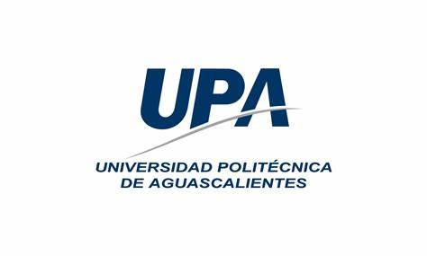
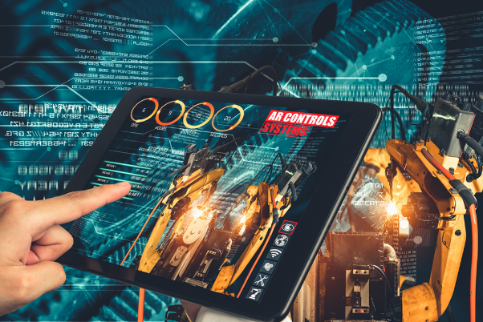

# Metodologia de la programacion 
### Universidad politecnica de aguascalientes
 
### Futuro ingeniero en mecatronica 

## ¿QUE ES LA MECATRONICA EN LA UPA?
### En Ingeniería Mecatrónica de UPA, formarás parte de una carrera que combina mecánica, electrónica, robótica y control para diseñar y desarrollar soluciones tecnológicas innovadoras. Esta integración de disciplinas te permitirá impulsar la automatización, la manufactura flexible y liderar la transformación de la industria.

